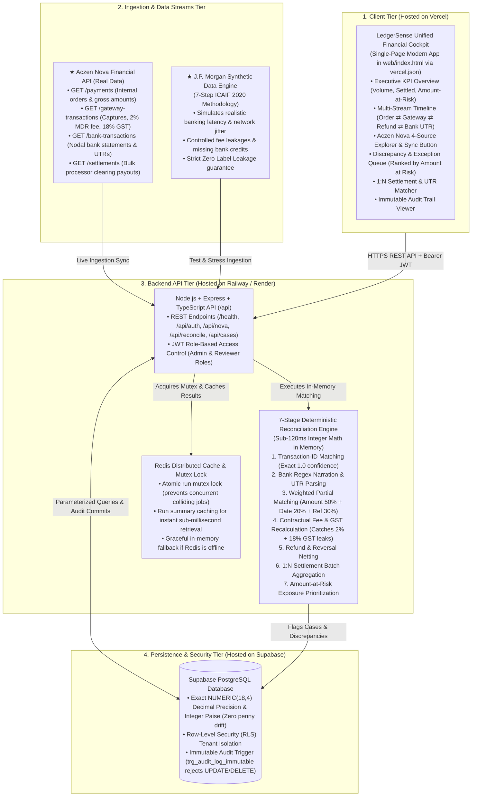

# FIN-11 LedgerSense | Real Architecture Flowchart & Image Generation Prompt

> **Visual Style**: Clean Light Mode (Pure White `#ffffff` background, soft slate borders `#e2e8f0`, modern vibrant accent tags: Blue `#2563eb`, Green `#10b981`, Amber `#f59e0b`, Purple `#8b5cf6`).
> **Real Tech Stack**: Vercel (Frontend) • Railway / Render (Backend API + Redis) • Supabase (PostgreSQL) • Aczen Nova API • J.P. Morgan Synthetic Data Engine.
> **Zero Fluff**: 100% accurate to the real codebase, working prototype, and active deployments.

---

## 1. Complete Architecture Flowchart (Mermaid)



---

## 2. ChatGPT / DALL-E Image Generation Prompt (Light Theme)

Copy and paste this prompt directly into **ChatGPT (GPT-4o / DALL-E 3)** to create the exact, clean architecture diagram for your slides:

```text
Please generate a crisp, clean, professional enterprise software architecture diagram titled:
"FIN-11 LedgerSense – End-to-End Payment Reconciliation & Settlement Architecture"

Visual Style & Layout:
- Clean bright light theme: Pure white background (#ffffff), soft light-gray cards (#f8fafc), thin slate borders (#e2e8f0) with subtle soft drop shadow.
- High resolution, 16:9 widescreen presentation layout.
- Professional vector typography, crisp colored icons (Vercel black/blue, Node.js green, Express gray, Redis red, PostgreSQL/Supabase green-blue, Aczen gold).
- No cluttered dark backgrounds, no 3D isometric clutter. Must look like an elite Stripe / Modern Treasury technical architecture diagram.

Diagram Structure (Top to Bottom):
1. TOP ROW [Client Tier - Hosted on Vercel]:
   - Wide Blue/Slate Box: "LedgerSense Unified Financial Cockpit (web/index.html on Vercel)"
   - Badges inside: "Executive KPI Dashboard", "Multi-Stream 4-Source Timeline", "Aczen Nova Feed Explorer", "Amount-at-Risk Exception Queue", "Settlement UTR Matcher", "Immutable Audit Viewer".

2. SECOND ROW [Ingestion & Data Streams]:
   - Gold/Amber Box: "Aczen Nova Financial API (Real Production Data)" with badges: "GET /payments", "GET /gateway-transactions", "GET /bank-transactions", "GET /settlements".
   - Violet/Purple Box: "J.P. Morgan AI Research Synthetic Generator (7-Step ICAIF 2020 Methodology)" with badge: "Realistic Latency, Fee Jitter & Edge-Case Stress Testing".

3. MIDDLE ROW [Backend Compute & Engine - Hosted on Railway / Render]:
   - Green Box: "Node.js + Express + TypeScript Backend API (/api)" with "JWT Auth & RBAC".
   - Central Cyan Box: "Deterministic 7-Stage Reconciliation Engine (Integer Paise, Sub-120ms)"
     * Stages: "1. ID Match" -> "2. Regex UTR Parse" -> "3. Partial Match" -> "4. Fee & GST Recalc" -> "5. Refund Netting" -> "6. 1:N Batch Settlement" -> "7. Risk Rank".
   - Red Box: "Redis Cache & Mutex Lock" (Distributed Job Mutex + Fast Summary Cache + In-Memory Fallback).

4. BOTTOM ROW [Persistence & Compliance - Hosted on Supabase]:
   - Teal/Navy Box: "Supabase PostgreSQL Database"
   - Badges: "Exact NUMERIC(18,4) Decimal Precision", "Row-Level Security (RLS) Tenant Isolation", "Immutable Append-Only Audit Trigger (trg_audit_log_immutable)".

5. FOOTER BADGES:
   - "0 Floating-Point Drift" • "Real Aczen Nova Accounting Data" • "J.P. Morgan Synthetic Stress Tested" • "Vercel + Railway + Supabase Live Deploy" • "Deterministic 7-Stage Math".

All labels must be sharp, technical, and 100% readable. No misspelled words.
```

---

## 3. 60-Second Teammate Explanation (Plain English Script)

Anyone on the team can read or memorize this exact 60-second explanation for evaluators:

> *"Judges, let me walk you through our real, working architecture in 60 seconds.*
> 
> *1. **The Client Tier:** We built a single, unified financial cockpit in modern HTML5, Tailwind, and JavaScript, deployed instantly on **Vercel**. It gives finance teams a 4-source timeline, an exception reviewer, a settlement matcher, and a live audit log.*
> 
> *2. **The Data Ingestion Tier:** We have an unfair advantage: we ingest real digital commerce accounting data directly from the **Aczen Nova Financial API** across orders, gateway captures, bank statements, and settlements with real 2% MDR fees and 18% GST. For edge cases and stress testing, we built a generator following **J.P. Morgan AI Research's 7-step synthetic methodology**.*
> 
> *3. **The Backend Tier:** Hosted on **Railway and Render**, our **Node.js Express TypeScript API** runs a **7-stage deterministic reconciliation engine**. In under 120 milliseconds, it runs in integer paise without any floating-point drift or hallucination.*
> 
> *4. **Distributed Caching:** We use **Redis** on Railway for run caching and mutex locks so two analysts never collide, with automatic in-memory fallback.*
> 
> *5. **The Database:** Our database is **Supabase PostgreSQL** using exact **`NUMERIC(18,4)` precision**, **Row-Level Security** for tenant isolation, and a **tamper-proof database trigger** that violently rejects any deletion of audit logs.*
> 
> *This entire stack is live, tested, and running right now."*

---

## 4. Problem Statement (FIN-11) 11 Key Modules Mapping

| FIN-11 Problem Module | Repo Implementation Location | Architecture Component |
|---|---|---|
| **1. Internal transaction records** | `api/src/novaClient.ts` (`fetchPayments`) | Aczen Nova `/payments` / Supabase `nova_payments` |
| **2. Payment gateway records** | `api/src/novaClient.ts` (`fetchGatewayTransactions`) | Aczen Nova `/gateway-transactions` (MDR + GST) |
| **3. Bank settlement records** | `api/src/novaClient.ts` (`fetchBankTransactions`) | Aczen Nova `/bank-transactions` (UTR statements) |
| **4. Transaction-ID matching** | `api/src/reconEngine.ts` (Stage 1) | Deterministic Hash Lookup ($O(N)$, Confidence = 1.0) |
| **5. Reference matching** | `api/src/reconEngine.ts` (Stage 2) | Bank Statement Regex Narration & UTR Parser |
| **6. Partial matching** | `api/src/reconEngine.ts` (Stage 3) | Multi-Factor Weighted Scoring (Amount + Date + Ref) |
| **7. Fee calculation** | `api/src/reconEngine.ts` (Stage 4) | Contractual 2% MDR + 18% GST Variance Detector |
| **8. Refund/reversal handling** | `api/src/reconEngine.ts` (Stage 5) | Refund Netting & Withholding Discrepancy Isolator |
| **9. Settlement matching** | `api/src/reconEngine.ts` (Stage 6) | 1:N Bulk Credit Aggregator (In-flight vs Missing) |
| **10. Exception management** | `api/src/server.ts` (`/api/cases/:id/decision`) | Amount-at-Risk Prioritized Queue & Decision Modal |
| **11. Reconciliation report** | `api/src/server.ts` (`/api/reconcile/latest`) | Executive KPI Summary, Run Dossier & Audit Export |
