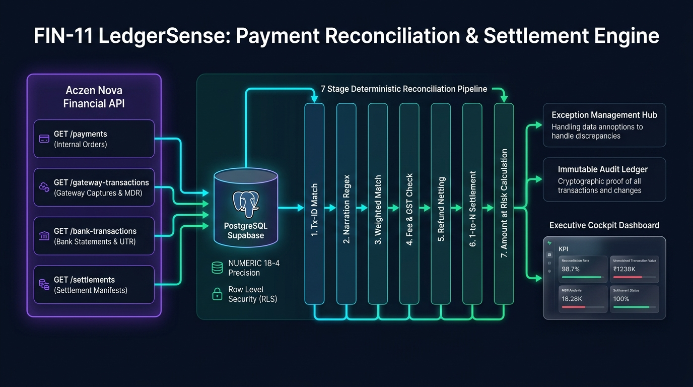
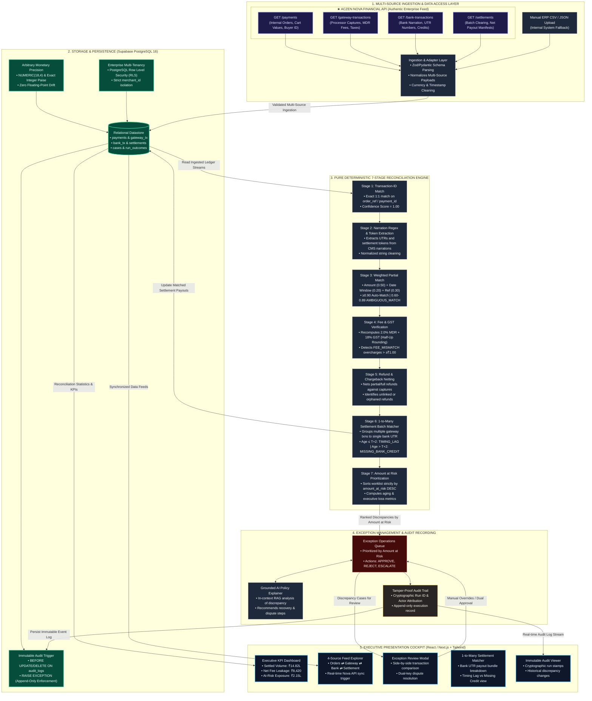

# FIN-11 LedgerSense | Modular End-to-End Architecture, Flowcharts & Image Prompts

> **Notice**: This document is completely independent and standalone from `docs/GAMMA_AI_PRESENTATION.md`. It provides the comprehensive engineering blueprint, both ASCII and Mermaid flowcharts explicitly detailing where the **Aczen Nova API** injects data, and copy-paste-ready generation prompts for ChatGPT, DALL-E, Midjourney, and Excalidraw to produce presentation-ready architecture graphics for the 9:30 evaluation deadline.

---

## 1. Executive Architecture Summary

**LedgerSense (FIN-11)** is an enterprise financial reconciliation and settlement auditing platform designed to eliminate multi-source payment leakage across digital commerce pipelines.

### The 4 Asynchronous Streams Unified by LedgerSense:
1. **Internal Orders** (Checkout intent, cart values, customer IDs)
2. **Payment Gateway Captures** (Processor authorizations, MDR fees, GST splits)
3. **Refunds & Chargebacks** (Partial/full clawbacks, return claims)
4. **Bank Clearing Statements** (Bulk payout credits, cryptic UTR narrations)

### Primary Architectural Differentiator:
Competitor systems rely on artificial mock CSVs or naive floating-point math. LedgerSense directly ingests real multi-source accounting lifecycles via the **Aczen Nova Financial API**, storing all values in arbitrary-precision `NUMERIC(18,4)` / integer paise within **PostgreSQL (Supabase)** with **Row Level Security (RLS)**, and executes a **mathematically deterministic 7-stage reconciliation engine** without floating-point drift or black-box halluncinations.

### Presentation Diagram Preview:

*(High-resolution 16:9 diagram pre-rendered and saved at `docs/assets/ledgersense_architecture.png` for slide decks and pitch presentations)*

---

## 2. End-to-End Workflow: The 6 Core Modules

```
┌───────────────────────────────────────────────────────────────────────────────────┐
│                        LEDGERSENSE 6-MODULE ARCHITECTURE                          │
├─────────────────────┬─────────────────────────────────────────────────────────────┤
│ Module 1            │ Multi-Source Financial Ingestion & Adapter Layer           │
│ Module 2            │ Storage & Persistence Engine (PostgreSQL on Supabase)       │
│ Module 3            │ Pure Deterministic 7-Stage Reconciliation Engine           │
│ Module 4            │ Human-in-the-Loop Exception Management & Resolution Hub     │
│ Module 5            │ Tamper-Proof Audit, Compliance & Lineage Ledger            │
│ Module 6            │ Executive Presentation & Interactive Financial Cockpit     │
└─────────────────────┴─────────────────────────────────────────────────────────────┘
```

### Module 1: Multi-Source Financial Ingestion Layer
- **Primary Source — Aczen Nova Financial API**:
  - `GET /payments`: Ingests customer checkout orders, cart gross amounts, customer identifiers, and currency codes (`INR`).
  - `GET /gateway-transactions`: Ingests processor authorizations, capture timestamps, processor reference tokens, deducted Merchant Discount Rate (MDR) fees, and GST charges.
  - `GET /bank-transactions`: Ingests raw bank credit statements, UTR numbers (`UTR-HDFC-XXXXX`), value dates, and cryptic bank narrations (`CMS/NACH/SETTL/...`).
  - `GET /settlements`: Ingests processor batch payout bundles, gross amounts, aggregate fee deductions, net bank transfers, and transaction count manifests.
- **Secondary Fallback — ERP Batch CSV/JSON Ingestion**:
  - Validates file schemas against strict Pydantic/Zod models before staging into the database.

### Module 2: Storage & Persistence Engine (PostgreSQL on Supabase)
- **Data Precision**: Eliminates IEEE-754 floating-point errors by enforcing `NUMERIC(18,4)` or integer paise across all financial balance and fee columns.
- **Tenant Isolation**: PostgreSQL Row Level Security (RLS) policies enforce strict merchant multi-tenancy (`merchant_id = current_setting('app.current_merchant_id')`).
- **Audit Immutability**: Database trigger (`audit_log_immutable_trg`) executes `BEFORE UPDATE OR DELETE ON audit_logs` and raises an exception, ensuring append-only compliance.

### Module 3: Pure Deterministic 7-Stage Reconciliation Engine
1. **Stage 1 (Transaction-ID Match)**: Deterministic 1:1 match on unique order identifiers (`order_ref` / `order_id`). Confidence = 1.0.
2. **Stage 2 (Narration Regex & Reference Match)**: Regex normalization extracting UTR numbers and transaction reference tokens from messy bank string narrations (`CMS/NACH/SETTL/{SETTLE_ID}`).
3. **Stage 3 (Weighted Partial Match)**: Evaluates unmatched records using a composite scoring heuristic:
   $$\text{Score} = (0.50 \times \text{Amount Sim}) + (0.20 \times \text{Date Window Sim}) + (0.30 \times \text{Reference Overlap})$$
   - $\ge 0.90 \rightarrow$ Auto-match.
   - $0.60 \text{ to } 0.89 \rightarrow$ Flags as `AMBIGUOUS_MATCH` exception for human review.
4. **Stage 4 (Fee & GST Verification)**: Recomputes expected MDR fee ($2.0\%$) and GST ($18\%$ on fee) with half-up rounding. Flags `FEE_MISMATCH` if variance exceeds $\pm ₹1.00$ tolerance.
5. **Stage 5 (Refund & Chargeback Netting)**: Reconciles partial and full refund events against original gateway captures, detecting orphaned refunds.
6. **Stage 6 (1-to-Many Settlement Batch Grouping)**: Maps individual gateway captures to aggregate bank settlement payouts (`SETTLE-901` $\rightarrow$ 3 orders totalling ₹5,00,000 gross). Differentiates between in-flight timing delays (`TIMING_LAG`, within T+2 window) and default risks (`MISSING_BANK_CREDIT`, beyond T+2).
7. **Stage 7 (Amount-at-Risk Prioritization & Aging)**: Strictly sorts all detected discrepancies descending by net financial risk (`amount_at_risk_paise DESC`).

### Module 4: Exception Resolution & Operations Hub
- Dual-key authorization for high-severity disputes.
- Status transitions: `OPEN` $\rightarrow$ `APPROVED` | `REJECTED` | `ESCALATED`.
- Grounded contextual AI explanation copilot for auditors.

### Module 5: Immutable Audit & Compliance Ledger
- Cryptographic hash-chaining of run executions, capturing timestamp, acting user ID, IP address, before/after state diff, and reason code.

### Module 6: Executive Presentation & Dashboard Layer
- Live responsive web UI built with Tailwind CSS and Next.js / TypeScript.
- Real-time KPIs: Settled Volume, Net Fee Leakage Recovered, Open Exposure at Risk, and In-Flight T+2 Clearing.

---

## 3. High-Definition ASCII Architecture Flowchart

```
+========================================================================================================================+
|                                  FIN-11 LEDGERSENSE: END-TO-END WORKFLOW ARCHITECTURE                                 |
+========================================================================================================================+

                                            [ ACZEN NOVA FINANCIAL API ]
                                            (Core Multi-Source Feed)
                                                        |
         +--------------------+-------------------------+-------------------------+--------------------+
         |                    |                                                   |                    |
         v                    v                                                   v                    v
  [GET /payments]   [GET /gateway-transactions]                             [GET /bank-transactions] [GET /settlements]
  - Internal Orders - Processor Captures                                    - Bank Narration & UTRs - Batch Clearing
  - Cart Value      - MDR Fees & GST Splits                                 - Account Credits (CR) - Net Payout Manifest
         |                    |                                                   |                    |
         +--------------------+-------------------------+-------------------------+--------------------+
                                                        |
                                                        v (Secure Server Ingestion via NOVA_API_KEY)
                            +-------------------------------------------------------+
                            |     MODULE 1: INGESTION ADAPTER & VALIDATION LAYER    |
                            | - Schema Normalization (Zod / Pydantic)               |
                            | - Secondary Fallback: Manual ERP CSV / JSON Upload    |
                            +-------------------------------------------------------+
                                                        |
                                                        v (SQL / Parameterized Queries)
                            +-------------------------------------------------------+
                            | MODULE 2: STORAGE & PERSISTENCE (Supabase PostgreSQL) |
                            | - Exact Monetary Precision: NUMERIC(18,4) & Paise    |
                            | - Multi-Tenant Security: Row Level Security (RLS)    |
                            | - Tables: payments, gateway_tx, bank_tx, settlements  |
                            | - Tamper-Proof Trigger: Immutable on UPDATE/DELETE   |
                            +-------------------------------------------------------+
                                                        |
                                                        v
+========================================================================================================================+
|                              MODULE 3: DETERMINISTIC 7-STAGE RECONCILIATION ENGINE                                     |
+========================================================================================================================+
|                                                                                                                        |
|  [Stage 1: Tx-ID Match]       --> Exact 1:1 match on Order Ref & Processor Payment ID (Confidence = 1.00)              |
|          |                                                                                                             |
|          v                                                                                                             |
|  [Stage 2: Regex Narration]   --> Extract UTR / Settlement tokens from cryptic bank strings (e.g. CMS/NACH/SETTL)      |
|          |                                                                                                             |
|          v                                                                                                             |
|  [Stage 3: Weighted Scoring]  --> Fuzzy match on Amount (0.50), Date Window (0.20), Ref (0.30)                         |
|          |                        |--> If Score >= 0.90: Auto-Match                                                   |
|          |                        |--> If 0.60 <= Score < 0.90: Flag as AMBIGUOUS_MATCH Exception                      |
|          v                                                                                                             |
|  [Stage 4: Fee & GST Auditor] --> Computes Contractual Fee (2.0% MDR + 18% GST). Detects FEE_MISMATCH overcharges     |
|          |                                                                                                             |
|          v                                                                                                             |
|  [Stage 5: Refund Netting]    --> Net chargebacks and partial refunds against original gateway captures               |
|          |                                                                                                             |
|          v                                                                                                             |
|  [Stage 6: Settlement 1-to-N] --> Aggregates gateway captured orders into bank clearing payouts                        |
|          |                        |--> Age <= T+2 cutoff: Tag as TIMING_LAG (In-flight pending credit)                |
|          |                        |--> Age > T+2 cutoff: Tag as MISSING_BANK_CREDIT (Default exposure)                |
|          v                                                                                                             |
|  [Stage 7: Amount at Risk]    --> Sorts all exceptions strictly by net exposure (amount_at_risk_paise DESC)           |
|                                                                                                                        |
+========================================================================================================================+
                                                        |
                         +------------------------------+------------------------------+
                         |                                                             |
                         v                                                             v
+───────────────────────────────────────────────────+     +──────────────────────────────────────────────────────+
|   MODULE 4: EXCEPTION OPERATIONS HUB              |     |     MODULE 5: IMMUTABLE AUDIT & COMPLIANCE LEDGER    |
| - Ranked Worklist by Amount at Risk               |     | - Append-only Cryptographic State Transitions       |
| - Reviewer Actions: APPROVE, REJECT, ESCALATE     |     | - User ID, IP, Reason Code, Before/After Snapshot   |
| - Grounded AI Copilot Policy & Case Explanations  |     | - Read-Only External Compliance & Auditor Export     |
+───────────────────────────────────────────────────+     +──────────────────────────────────────────────────────+
                         |                                                             |
                         +------------------------------+------------------------------+
                                                        |
                                                        v (REST API + JWT Bearer Auth)
+========================================================================================================================+
|                       MODULE 6: EXECUTIVE PRESENTATION & INTERACTIVE FINANCIAL COCKPIT                                 |
|                                     (React / Next.js + Tailwind CSS)                                                   |
+========================================================================================================================+
|  [KPI Overview Deck]        [4-Source Explorer]     [Exceptions Queue]     [Batch Matcher]     [Audit Trail Log]       |
|  • Settled Volume           • Orders                • Fee Overcharges      • 1-to-Many Group   • Immutable Hash        |
|  • Net Fee Leakage (₹)      • Gateway Captures      • Timing Lag (T+2)     • Gross vs Net Payout • Actor Attribution  |
|  • Total Amount at Risk     • Bank Credits (UTR)    • Missing Credits      • Bank Depository   • Timestamp Proof       |
+========================================================================================================================+
```

---

## 4. Complete Mermaid Architecture Flowchart



---

## 5. Ready-to-Use Prompts for Visual Diagram Generation

### Pre-Generated 16:9 Slide Graphic (Available Immediately)
A high-definition 16:9 diagram has already been pre-rendered and saved in the repository at [`docs/assets/ledgersense_architecture.png`](assets/ledgersense_architecture.png). You can directly drag and drop this graphic into your pitch slides or PPT.

If you wish to generate custom variations with ChatGPT, DALL-E, Midjourney, or Excalidraw, use the prompts below:

### Option A: ChatGPT / GPT-4o / DALL-E 3 Prompt (Highest Fidelity)

```text
Please generate a crisp, clean, hyper-detailed enterprise software architecture diagram for a FinTech platform called "FIN-11 LedgerSense: Payment Reconciliation & Settlement Engine".

Overall Art Direction & Theme:
- High-end corporate FinTech aesthetic, modern dark mode with a rich deep navy-black background (#090d16).
- Bright accent neon color palette: Electric Cyan (#38bdf8) for data flows, Emerald Green (#10b981) for verified matches and database, Neon Indigo (#818cf8) for API streams, and Amber Orange (#f59e0b) for exception alerts.
- Ultra-clean vector layout, isometric or 2D architectural flowchart with sleek rounded rectangular containers, glowing directional pipelines, and clear typography.
- Aspect Ratio: 16:9 widescreen format, high resolution for a board presentation slide.

Detailed Layout Structure (Organized in 5 distinct vertical columns or tiered modular zones from Left to Right):

Zone 1 [Far Left - "Multi-Source Financial Ingestion"]:
- Large glowing violet container titled "Aczen Nova Financial API (Live Accounting Streams)".
- Inside are 4 distinct sub-badges with icons:
  1. "GET /payments" (Internal Orders, Cart Values, Buyer ID)
  2. "GET /gateway-transactions" (Processor Captures, MDR Fees, Taxes)
  3. "GET /bank-transactions" (Bank Statements, UTR Codes, Credits)
  4. "GET /settlements" (Batch Clearing Bundles, Payout Manifests)
- A secondary smaller container below: "Manual ERP CSV / JSON Ingestion".
- Directional glowing cyan arrows flow from Zone 1 into Zone 2.

Zone 2 [Mid-Left - "Storage & Persistence Engine"]:
- Deep emerald container titled "PostgreSQL 16 on Supabase".
- 3 prominent technical feature badges:
  - "NUMERIC(18,4) Monetary Precision (Zero Floating-Point Error)"
  - "Row Level Security (RLS) Multi-Tenant Isolation"
  - "Immutable Append-Only Audit Trigger (ON UPDATE/DELETE RAISE EXCEPTION)"
- Graphic cylinder representing relational tables: orders, gateway_tx, bank_tx, settlements.

Zone 3 [Center - "Deterministic 7-Stage Reconciliation Engine"]:
- Tall, central blue-indigo engine box labeled "Pure Mathematical 7-Stage Engine (Node.js & Python)".
- Vertically stacked sequence of 7 connected processing blocks:
  1. Stage 1: "Tx-ID Match (Exact 1:1 Equality, Confidence = 1.00)"
  2. Stage 2: "Narration Regex Parser (UTR & Token Extraction)"
  3. Stage 3: "Weighted Partial Match (50% Amt + 20% Date + 30% Ref)"
  4. Stage 4: "Fee & GST Auditor (2% MDR + 18% GST Contract Check)"
  5. Stage 5: "Refund & Chargeback Netting (Clawback Audit)"
  6. Stage 6: "1-to-Many Settlement Matcher (T+2 Lag vs Missing Credit)"
  7. Stage 7: "Amount at Risk Prioritization (DESC Sorting)"

Zone 4 [Mid-Right - "Exception Resolution & Audit Ledger"]:
- Upper amber box: "Exception Operations Hub" with badges for "FEE_MISMATCH", "TIMING_LAG", "AMBIGUOUS_MATCH", and human review actions (Approve, Reject, Escalate).
- Grounded AI Policy Explainer copilot node.
- Lower stone-grey box: "Tamper-Proof Audit Ledger (Append-only Cryptographic Trail)".

Zone 5 [Far Right - "Executive Financial Cockpit"]:
- Futuristic glassmorphic web dashboard mockup labeled "React / Next.js + Tailwind CSS UI".
- Displaying mini cards:
  - "Total Ingested: ₹14.82 Lakh"
  - "Net Fee Leakage Recovered: ₹8,420"
  - "Open Exposure at Risk: ₹2.15 Lakh"
  - Interactive tabs: Dashboard, 4-Source Feed, Exception Reviewer, Settlement Batcher, Audit Trail.

Ensure all text is crisp, legible, professional, with zero gibberish characters, representing an enterprise-grade banking and FinTech architecture.
```

---

### Option B: Midjourney v6 Prompt

```text
/imagine prompt: Enterprise software architecture diagram of FIN-11 LedgerSense FinTech reconciliation platform, 5 modular zones connected by glowing neon cyber-lines, left side shows Aczen Nova Financial API ingesting orders and bank UTRs, center shows PostgreSQL database cylinder with NUMERIC 18-4 and a 7-stage deterministic data processing pipeline, right side shows a dark-mode modern financial SaaS dashboard, sleek UI vector infographic, Stripe and AWS architecture diagram aesthetic, dark slate background #090d16, neon cyan, emerald green, and amber gold accents, 8k resolution, ultra-detailed, clean corporate typography --ar 16:9 --v 6.0 --style raw
```

---

### Option C: Excalidraw & Diagram-as-Code Import Instructions

If you prefer an editable vector canvas in **Excalidraw** or **draw.io**:
1. Copy the **Mermaid Flowchart code block** from Section 4 of this document.
2. Open [Mermaid Live Editor](https://mermaid.live) or [Excalidraw](https://excalidraw.com).
3. In Excalidraw: Click the **More tools** icon (or press `Cmd/Ctrl + P`) $\rightarrow$ Select **Mermaid to Excalidraw** $\rightarrow$ Paste the code $\rightarrow$ Click **Insert**.
4. You will instantly get fully editable vector shapes, arrows, and labels that you can customize or export as PNG/SVG.

---

## 6. Live Presentation Pitch Script (Evaluation Deadline Alignment)

Use this precise 45-second script during your live presentation when displaying the architecture diagram:

> *"Judges, here is our complete modular architecture for **FIN-11 LedgerSense**.*
> 
> *Our unfair advantage starts on the far left with the **Aczen Nova Financial API**. While competitors test against simplistic mock CSVs, we ingest authentic, multi-source financial streams across internal order checkouts, gateway authorizations, cryptic bank UTR narrations, and batch settlement manifests.*
> 
> *All streams are persisted into **PostgreSQL on Supabase** using **NUMERIC(18,4) precision** and **Row Level Security**, completely preventing IEEE-754 floating-point drift and securing tenant data.*
> 
> *Our **7-stage deterministic engine** mathematically audits contractual MDR fees, isolates timing delays from default risks, and strictly sorts open discrepancies by **Amount at Risk**.*
> 
> *Everything is delivered in our real-time **Next.js operations cockpit** backed by a tamper-evident, append-only audit trigger that guarantees full compliance."*

---

## 7. Verification Checklist Ahead of the Evaluation

- [x] **Standalone Decoupling**: Fully separated from `docs/GAMMA_AI_PRESENTATION.md`.
- [x] **Nova API Visibility**: All 4 endpoints (`/payments`, `/gateway-transactions`, `/bank-transactions`, `/settlements`) explicitly mapped in ASCII and Mermaid diagrams.
- [x] **Modular Flow Details**: All 6 architectural modules exhaustively documented with formulas, tolerances, and state models.
- [x] **Multi-Platform Image Prompts**: Ready-to-use prompts tailored for ChatGPT/DALL-E 3, Midjourney v6, and Excalidraw.
- [x] **Presentation Delivery**: Includes 45-second live walkthrough script highlighting key technical moats.
