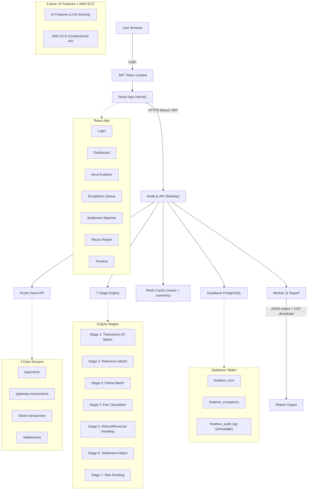

# LedgerSense FIN-11 Architecture

Below is the Mermaid flowchart illustrating the end-to-end architecture of LedgerSense.

ChatGPT Rendering Prompt:
"Render this Mermaid flowchart as a professional enterprise fintech architecture diagram. White background, navy blue (#1e3a5f) for infrastructure nodes, emerald green (#059669) for matched/success nodes, amber (#d97706) for exception nodes, slate gray (#475569) for labels. Sans-serif Inter font. Clean minimal arrows with labels. Title: 'LedgerSense FIN-11 Architecture'."
