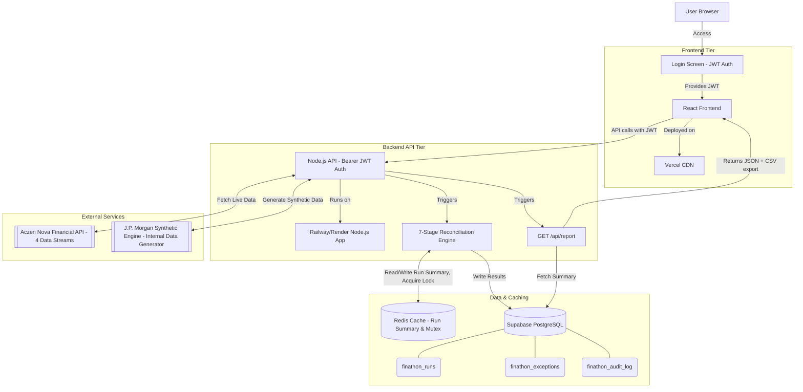

# FIN11 Architecture Flowchart

```mermaid
flowchart TD
    %% Users and Access
    User[User Browser]
    
    %% Frontend Tier
    subgraph Frontend [Frontend Tier]
        Login[Login Screen - JWT Auth]
        React[React Frontend]
        Vercel[Vercel CDN]
    end
    
    %% API Tier
    subgraph Backend [Backend API Tier]
        NodeAPI[Node.js API - Bearer JWT Auth]
        Railway[Railway/Render Node.js App]
        ReconEngine[7-Stage Reconciliation Engine]
        ReportAPI[GET /api/report]
    end
    
    %% Cache & Persistence
    subgraph Persistence [Data & Caching]
        Redis[(Redis Cache - Run Summary & Mutex)]
        Supabase[(Supabase PostgreSQL)]
        RunsTable(finathon_runs)
        ExceptionsTable(finathon_exceptions)
        AuditTable(finathon_audit_log)
    end
    
    %% External Feeds
    subgraph External [External Services]
        NovaAPI[[Aczen Nova Financial API - 4 Data Streams]]
        JPM[[J.P. Morgan Synthetic Engine - Internal Data Generator]]
    end

    %% Connections
    User -->|Access| Login
    Login -->|Provides JWT| React
    React -->|Deployed on| Vercel
    React -->|API calls with JWT| NodeAPI
    NodeAPI -->|Runs on| Railway
    
    NodeAPI <-->|Fetch Live Data| NovaAPI
    NodeAPI <-->|Generate Synthetic Data| JPM
    
    NodeAPI -->|Triggers| ReconEngine
    NodeAPI -->|Triggers| ReportAPI
    ReportAPI -->|Returns JSON + CSV export| React
    
    ReconEngine <-->|Read/Write Run Summary, Acquire Lock| Redis
    ReconEngine -->|Write Results| Supabase
    ReportAPI -->|Fetch Summary| Supabase
    
    Supabase --- RunsTable
    Supabase --- ExceptionsTable
    Supabase --- AuditTable
```
