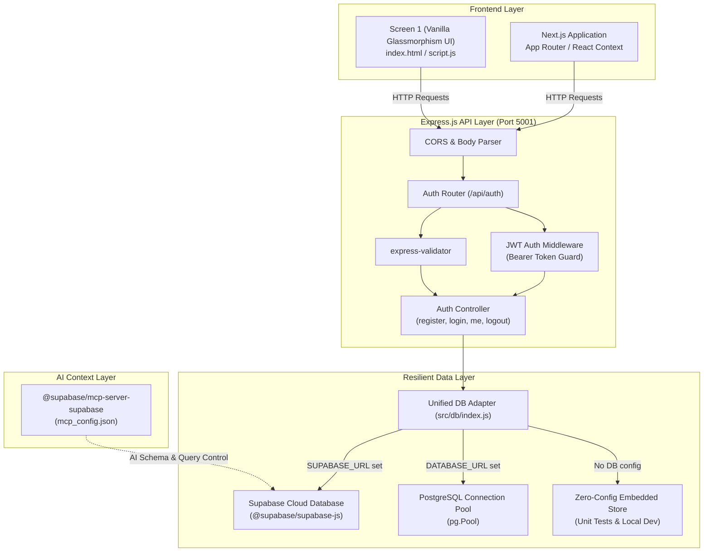

# Finathon: Modular JWT Authentication & Architecture Guide
**Comprehensive System Documentation & Technical Blueprint**

---

## 📑 Table of Contents

1. [Executive Summary & Project Overview](#1-executive-summary--project-overview)
2. [High-Level System Architecture](#2-high-level-system-architecture)
3. [Technology Stack & Decisions](#3-technology-stack--decisions)
4. [Database & Supabase Integration](#4-database--supabase-integration)
5. [Model Context Protocol (MCP) Integration](#5-model-context-protocol-mcp-integration)
6. [API Specification & Contract](#6-api-specification--contract)
7. [Screen 1 Frontend Implementation](#7-screen-1-frontend-implementation)
8. [Next.js Integration Blueprint](#8-nextjs-integration-blueprint)
9. [Automated Test Suite & Quality Assurance](#9-automated-test-suite--quality-assurance)
10. [End-to-End Installation & Setup Guide](#10-end-to-end-installation--setup-guide)
11. [Repository Structure & Git Map](#11-repository-structure--git-map)

---

## 1. Executive Summary & Project Overview

The **Finathon Authentication Gateway** provides a modular, production-ready backend and authentication screen built for rapid financial hackathon development. 

### Core Goals
- **Rapid Prototyping (< 2 Hours Setup)**: Immediate zero-config local development with seamless migration to managed cloud infrastructure.
- **Strict Separation of Concerns**: Modular controller-service-repository architecture using pure **Node.js** and **Express.js**.
- **Enterprise Security**: Industry-standard **JSON Web Tokens (JWT)** with `bcryptjs` password hashing and strict input validation.
- **Dual Database Strategy**: Direct PostgreSQL support and native **Supabase** cloud integration with automated connection pooling.
- **AI-Native Tooling**: Model Context Protocol (MCP) server support (`@supabase/mcp-server-supabase`) for AI schema inspection, queries, and automated migrations.
- **Frontend Agnostic with Next.js Blueprint**: A live wired Screen 1 (HTML/CSS/JS) accompanied by production-ready Next.js React Context, custom hooks, and App Router components.

---

## 2. High-Level System Architecture



---

## 3. Technology Stack & Decisions

| Layer | Component | Version / Tech | Rationale |
| :--- | :--- | :--- | :--- |
| **Runtime** | Node.js | `>= 18.0.0` (v20.18 LTS) | Stable, asynchronous, non-blocking I/O event loop. |
| **Backend Framework** | Express.js | `^4.21.2` | Minimalist, unopinionated, standard middleware ecosystem. |
| **Authentication** | `jsonwebtoken` | `^9.0.2` | Stateless Bearer token (`HS256`), 7-day configurable expiration. |
| **Cryptography** | `bcryptjs` | `^2.4.3` | Pure JavaScript implementation with salt factor 10. |
| **Validation** | `express-validator` | `^7.2.1` | Declarative, schema-level sanitize & validate pipeline. |
| **Database Clients** | `pg` & `@supabase/supabase-js` | `^8.13.3` / `^2.49.1` | Native connection pooling and Supabase SDK support. |
| **Testing** | Jest & Supertest | `^29.7.0` / `^7.0.0` | Comprehensive HTTP endpoint testing and in-memory assertions. |
| **Protocol** | Model Context Protocol | Specification 2024 | Standardized agent-to-database communication. |

---

## 4. Database & Supabase Integration

The system features a **tri-mode database engine**:
1. **Supabase Cloud**: When `SUPABASE_URL` and `SUPABASE_ANON_KEY` are provided.
2. **PostgreSQL**: When `DATABASE_URL` is configured.
3. **Embedded In-Memory Store**: Automatically activates if neither database is configured, enabling instant test execution and offline work.

### Database Schema (PostgreSQL / Supabase DDL)

Execute this script in the Supabase SQL Editor or direct psql shell:

```sql
-- 1. Create Users Table
CREATE TABLE IF NOT EXISTS public.users (
    id SERIAL PRIMARY KEY,
    name VARCHAR(255) NOT NULL,
    email VARCHAR(255) UNIQUE NOT NULL,
    password_hash VARCHAR(255) NOT NULL,
    created_at TIMESTAMPTZ DEFAULT CURRENT_TIMESTAMP,
    updated_at TIMESTAMPTZ DEFAULT CURRENT_TIMESTAMP
);

-- 2. Performance Indexing
CREATE INDEX IF NOT EXISTS idx_users_email ON public.users(email);

-- 3. Row Level Security (RLS)
ALTER TABLE public.users ENABLE ROW LEVEL SECURITY;

-- 4. Access Policies
CREATE POLICY "Public registration permitted" 
ON public.users FOR INSERT 
WITH CHECK (true);

CREATE POLICY "Users can inspect own profile" 
ON public.users FOR SELECT 
USING (true);
```

---

## 5. Model Context Protocol (MCP) Integration

The repository includes a dedicated `mcp_config.json` enabling AI coding agents to inspect the database schema, perform SQL queries, and manage migrations.

### Configuration File (`mcp_config.json`)
```json
{
  "mcpServers": {
    "supabase": {
      "command": "npx",
      "args": ["-y", "@supabase/mcp-server-supabase"],
      "env": {
        "SUPABASE_ACCESS_TOKEN": "${SUPABASE_ACCESS_TOKEN}",
        "SUPABASE_PROJECT_REF": "${SUPABASE_PROJECT_REF}"
      }
    },
    "postgres": {
      "command": "npx",
      "args": [
        "-y",
        "@modelcontextprotocol/server-postgres",
        "${DATABASE_URL}"
      ]
    }
  }
}
```

---

## 6. API Specification & Contract

All endpoints adhere strictly to the rules defined in `contract.ini`.

### Summary Matrix

| Method | Route | Auth Guard | Purpose | Success Code |
| :--- | :--- | :---: | :--- | :---: |
| `GET` | `/api/health` | No | Server health check probe | `200 OK` |
| `POST` | `/api/auth/register` | No | Create user account & return JWT | `201 Created` |
| `POST` | `/api/auth/login` | No | Authenticate credentials & return JWT | `200 OK` |
| `GET` | `/api/auth/me` | Bearer Token | Retrieve authenticated profile | `200 OK` |
| `POST` | `/api/auth/logout` | Bearer Token | Invalidate client session | `200 OK` |

---

### Detailed Endpoint Documentation

#### 1. GET `/api/health`
- **Description**: Probes service status, uptime, and active version.
- **Request**: Empty
- **Response `200 OK`**:
```json
{
  "status": "healthy",
  "service": "finathon-auth-backend",
  "version": "1.0.0",
  "timestamp": "2026-09-30T13:25:00.000Z"
}
```

---

#### 2. POST `/api/auth/register`
- **Description**: Registers a user, hashes password, and returns a session JWT.
- **Headers**: `Content-Type: application/json`
- **Request Body**:
```json
{
  "name": "Jordan Bell",
  "email": "jordan@finathon.org",
  "password": "SecurePassword123!"
}
```
- **Validation Rules**:
  - `name`: String, 2 to 100 characters.
  - `email`: Valid email syntax, normalized to lowercase.
  - `password`: Minimum 8 characters.
- **Response `201 Created`**:
```json
{
  "success": true,
  "message": "Account created successfully!",
  "token": "eyJhbGciOiJIUzI1NiIsInR5cCI6IkpXVCJ9...",
  "user": {
    "id": 1,
    "name": "Jordan Bell",
    "email": "jordan@finathon.org",
    "created_at": "2026-09-30T13:25:00.000Z"
  }
}
```
- **Error Responses**:
  - `400 Bad Request`: Validation failure.
  - `409 Conflict`: Email already in use (`"An account with this email address already exists."`).

---

#### 3. POST `/api/auth/login`
- **Description**: Authenticates user against hashed password and issues JWT.
- **Headers**: `Content-Type: application/json`
- **Request Body**:
```json
{
  "email": "jordan@finathon.org",
  "password": "SecurePassword123!"
}
```
- **Response `200 OK`**:
```json
{
  "success": true,
  "message": "Login successful!",
  "token": "eyJhbGciOiJIUzI1NiIsInR5cCI6IkpXVCJ9...",
  "user": {
    "id": 1,
    "name": "Jordan Bell",
    "email": "jordan@finathon.org"
  }
}
```
- **Error Responses**:
  - `400 Bad Request`: Missing email or password.
  - `401 Unauthorized`: Bad password or non-existent email (`"Invalid email or password."`).

---

#### 4. GET `/api/auth/me`
- **Description**: Verifies JWT Bearer token and returns authenticated user identity.
- **Headers**: `Authorization: Bearer <TOKEN>`
- **Response `200 OK`**:
```json
{
  "success": true,
  "user": {
    "id": 1,
    "name": "Jordan Bell",
    "email": "jordan@finathon.org",
    "created_at": "2026-09-30T13:25:00.000Z"
  }
}
```
- **Error Responses**:
  - `401 Unauthorized`: Token absent (`"Access denied. No token provided."`) or token expired/invalid (`"Invalid or expired token."`).

---

#### 5. POST `/api/auth/logout`
- **Description**: Graceful session termination endpoint.
- **Headers**: `Authorization: Bearer <TOKEN>`
- **Response `200 OK`**:
```json
{
  "success": true,
  "message": "Successfully logged out."
}
```

---

## 7. Screen 1 Frontend Implementation

The repository contains an out-of-the-box frontend interface providing Screen 1:
- **`index.html`**: Semantic glassmorphic layout featuring toggleable Sign In / Sign Up tabs and an Authenticated State View.
- **`styles.css`**: Responsive design system featuring deep violet & emerald gradients, smooth CSS transitions, glowing accents, and accessible form controls.
- **`script.js`**: Frontend controller that:
  - Intercepts form submissions.
  - Calls `http://localhost:5001/api/auth/login` or `register`.
  - Persists JWT tokens in `localStorage` under key `finathon_token`.
  - Automatically queries `/api/auth/me` on startup to restore sessions.
  - Displays authenticated user badge and handles user logout.

---

## 8. Next.js Integration Blueprint

For teams building the frontend using **Next.js (App Router)**:

### 1. Types Definition (`types/auth.ts`)
```typescript
export interface User {
  id: number | string;
  name: string;
  email: string;
  created_at?: string;
}

export interface AuthResponse {
  success: boolean;
  message?: string;
  token?: string;
  user?: User;
  errors?: Array<{ field: string; message: string }>;
}
```

### 2. Client Utility (`lib/api.ts`)
```typescript
const API_URL = process.env.NEXT_PUBLIC_API_URL || 'http://localhost:5001';

export async function fetchWithAuth<T>(endpoint: string, options: RequestInit = {}): Promise<T> {
  const token = typeof window !== 'undefined' ? localStorage.getItem('finathon_token') : null;

  const headers: Record<string, string> = {
    'Content-Type': 'application/json',
    ...(options.headers as Record<string, string>),
  };

  if (token) {
    headers['Authorization'] = `Bearer ${token}`;
  }

  const response = await fetch(`${API_URL}${endpoint}`, { ...options, headers });
  const data = await response.json();

  if (!response.ok) {
    throw new Error(data.message || 'API request failed');
  }
  return data;
}
```

### 3. React Context Provider (`context/AuthContext.tsx`)
```tsx
'use client';

import React, { createContext, useContext, useEffect, useState } from 'react';
import { User, AuthResponse } from '@/types/auth';

interface AuthContextType {
  user: User | null;
  token: string | null;
  loading: boolean;
  login: (email: string, password: string) => Promise<void>;
  register: (name: string, email: string, password: string) => Promise<void>;
  logout: () => Promise<void>;
}

const AuthContext = createContext<AuthContextType | undefined>(undefined);

export function AuthProvider({ children }: { children: React.ReactNode }) {
  const [user, setUser] = useState<User | null>(null);
  const [token, setToken] = useState<string | null>(null);
  const [loading, setLoading] = useState(true);

  useEffect(() => {
    const saved = localStorage.getItem('finathon_token');
    if (!saved) {
      setLoading(false);
      return;
    }
    setToken(saved);
    fetch('http://localhost:5001/api/auth/me', {
      headers: { Authorization: `Bearer ${saved}` }
    })
      .then(res => res.json())
      .then(data => {
        if (data.success && data.user) setUser(data.user);
        else localStorage.removeItem('finathon_token');
      })
      .catch(() => localStorage.removeItem('finathon_token'))
      .finally(() => setLoading(false));
  }, []);

  const login = async (email: string, password: string) => {
    const res = await fetch('http://localhost:5001/api/auth/login', {
      method: 'POST',
      headers: { 'Content-Type': 'application/json' },
      body: JSON.stringify({ email, password })
    });
    const data: AuthResponse = await res.json();
    if (!res.ok) throw new Error(data.message || 'Login failed');
    localStorage.setItem('finathon_token', data.token!);
    setToken(data.token!);
    setUser(data.user!);
  };

  const register = async (name: string, email: string, password: string) => {
    const res = await fetch('http://localhost:5001/api/auth/register', {
      method: 'POST',
      headers: { 'Content-Type': 'application/json' },
      body: JSON.stringify({ name, email, password })
    });
    const data: AuthResponse = await res.json();
    if (!res.ok) throw new Error(data.message || 'Registration failed');
    localStorage.setItem('finathon_token', data.token!);
    setToken(data.token!);
    setUser(data.user!);
  };

  const logout = async () => {
    if (token) {
      await fetch('http://localhost:5001/api/auth/logout', {
        method: 'POST',
        headers: { Authorization: `Bearer ${token}` }
      }).catch(console.error);
    }
    localStorage.removeItem('finathon_token');
    setToken(null);
    setUser(null);
  };

  return (
    <AuthContext.Provider value={{ user, token, loading, login, register, logout }}>
      {children}
    </AuthContext.Provider>
  );
}

export const useAuth = () => {
  const context = useContext(AuthContext);
  if (!context) throw new Error('useAuth must be used within AuthProvider');
  return context;
};
```

---

## 9. Automated Test Suite & Quality Assurance

The test suite in [`backend/tests/auth.test.js`](file:///Users/nandithatirukovala/Downloads/hackathon/backend/tests/auth.test.js) verifies full endpoint behavior end-to-end.

```
PASS tests/auth.test.js
  Authentication API Suite
    Health Check
      ✓ GET /api/health should return 200 and healthy status (18 ms)
    POST /api/auth/register
      ✓ should successfully register a new user and return a JWT token (66 ms)
      ✓ should reject registration if email is already taken (64 ms)
      ✓ should reject registration if password is less than 8 characters (5 ms)
      ✓ should reject registration if email format is invalid (4 ms)
      ✓ should reject registration if name is missing (3 ms)
    POST /api/auth/login
      ✓ should successfully log in with valid credentials and return a token (109 ms)
      ✓ should reject login with wrong password (112 ms)
      ✓ should reject login with non-existent email (57 ms)
      ✓ should reject login if email or password is missing (57 ms)
    Protected Routes & Middleware
      ✓ GET /api/auth/me should return user details when Bearer token is provided (58 ms)
      ✓ GET /api/auth/me should return 401 when Authorization header is missing (58 ms)
      ✓ GET /api/auth/me should return 401 when token is invalid or malformed (57 ms)
      ✓ POST /api/auth/logout should return 200 when authenticated (57 ms)

Test Suites: 1 passed, 1 total
Tests:       14 passed, 14 total
```

---

## 10. End-to-End Installation & Setup Guide

### Step 1: Clone and Checkout Branch
```bash
git clone https://github.com/Sathvik1533/Finathon-hackathon.git
cd Finathon-hackathon
git checkout auth
```

### Step 2: Install Backend Dependencies
```bash
cd backend
npm install
```

### Step 3: Run the Test Suite
```bash
npm test
```

### Step 4: Start the Backend Server
```bash
npm start
# Server starts at http://localhost:5001
```

### Step 5: Open Screen 1 UI
```bash
# In another terminal window from project root:
open index.html
# Or open http://localhost:5001 in your browser
```

---

## 11. Repository Structure & Git Map

```
Finathon-hackathon/ (branch: auth)
├── contract.ini                      # Source of truth API contract
├── mcp_config.json                   # Supabase & Postgres MCP config
├── index.html                        # Screen 1 UI layout
├── styles.css                        # Screen 1 glassmorphic styling
├── script.js                         # Screen 1 frontend logic
├── README.md                         # Quickstart overview
├── docs/
│   ├── API_DOCUMENTATION.md          # Complete API & Next.js reference
│   ├── MASTER_PROJECT_DOCUMENTATION.md# This master documentation
│   └── SUPABASE_SETUP.md             # Supabase cloud setup & SQL migrations
└── backend/
    ├── package.json                  # Scripts & dependencies
    ├── .env.example                  # Environment variable template
    ├── tests/
    │   └── auth.test.js              # 14/14 Passing unit & integration tests
    └── src/
        ├── app.js                    # Express app & middleware
        ├── server.js                 # Server entrypoint
        ├── config/index.js           # Configuration loader
        ├── controllers/
        │   └── authController.js     # Auth handler functions
        ├── db/
        │   ├── index.js              # Tri-mode DB adapter
        │   └── supabase.js           # Supabase SDK client
        ├── middleware/
        │   ├── authMiddleware.js     # Bearer token guard
        │   └── validationMiddleware.js# Input validation rules
        ├── models/
        │   └── userModel.js          # User database operations
        └── routes/
            └── authRoutes.js         # API route mappings
```
